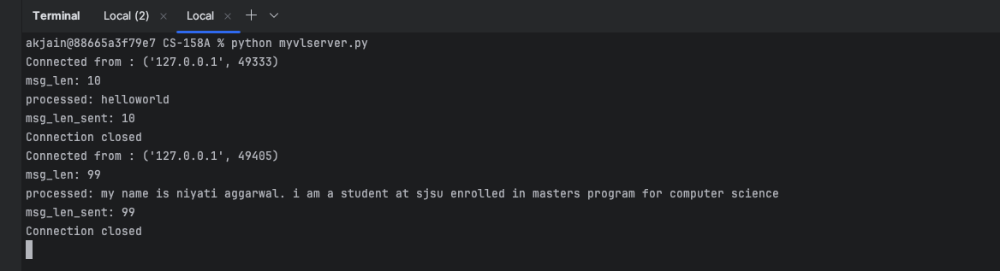
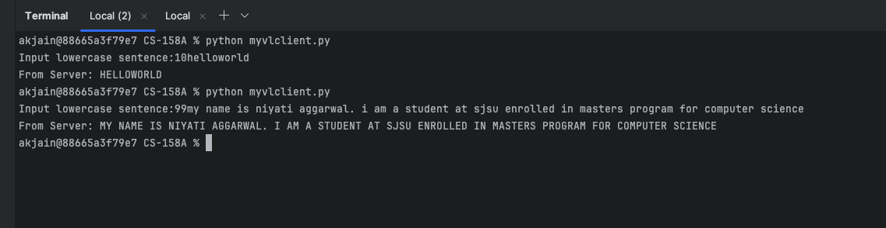

## Overview
This simple program demonstrates the interaction of basic client and server using TCP connection

## Setup
### Start the server

```commandline
python myvlserver.py
```
The server starts and waits for a connection from the client. It waits until client sends message, and keeps running after processing message from a client. The server needs to be manually terminated.

### Start the client

```commandline
python myvlclient.py
```
The client takes any string with length from (1-99) characters as input with string length as first 2 characters and sends it to the server. It prints the response received from server which is just the capitalized form of the input message string.

## Examples

### Example 1 (message string smaller than buffer length)
_Server Output_
```
Connected from : ('127.0.0.1', 62120)
msg_len: 10
processed: helloworld
msg_len_sent: 10
Connection closed
```

_Client Output_
```
Enter a lowercase sentence: 10helloworld   
From server: HELLOWORLD
```


### Example 2 (message string larger than buffer length)
_Server Output_
```
Connected from : ('127.0.0.1', 62653)
msg_len: 99
processed: my name is niyati aggarwal. i am a student at sjsu enrolled in masters program for computer science
msg_len_sent: 99
Connection closed
```

_Client Output_
```
Input lowercase sentence:99my name is niyati aggarwal. i am a student at sjsu enrolled in masters program for computer science
From Server: MY NAME IS NIYATI AGGARWAL. I AM A STUDENT AT SJSU ENROLLED IN MASTERS PROGRAM FOR COMPUTER SCIENCE
```

## Screenshots

### Server Screenshot


### Client Screenshot
