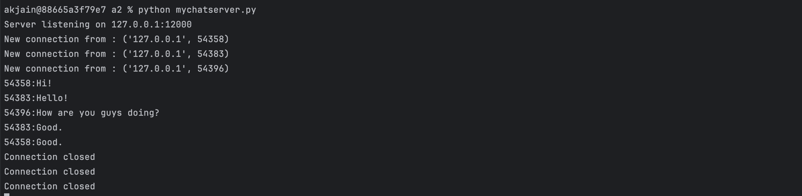
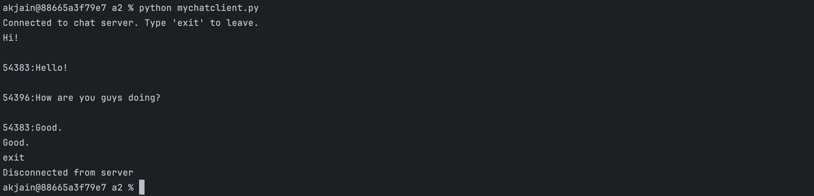
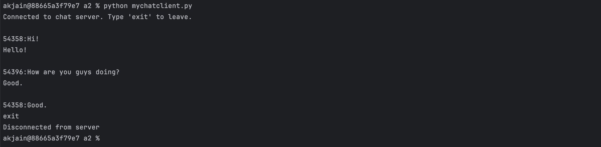
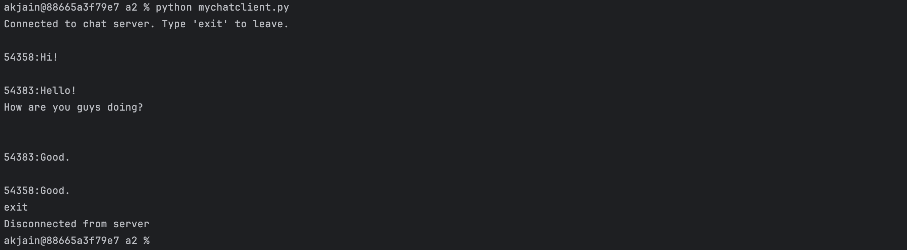

## Overview
This simple program demonstrates a chat server that allows multiple clients to join and exchange messages over a TCP connection.

## Setup
### Start the server

```commandline
python mychatserver.py
```
The server initializes and begins listening for incoming connections from multiple clients. It continuously runs until manually terminated. Upon accepting a client connection, the server adds the client to a list of active connections. It then waits to receive messages from the connected clients and, upon receiving a message, relays it to all other active clients—excluding the original sender.

### Start the client

```commandline
python mychatclient.py
```
Each client in the system can both send messages to the server and receive messages from other connected clients. The server is capable of handling any number of clients, and this can be adjusted by changing the maximum number of connections it listens for. In my implementation, I demonstrate the functionality using three clients. Each client is launched manually in a separate terminal window to simulate independent users participating in the chat.

## Examples

### Example 1
_Server Output_
```
Server listening on 127.0.0.1:12000
New connection from : ('127.0.0.1', 54358)
New connection from : ('127.0.0.1', 54383)
New connection from : ('127.0.0.1', 54396)
54358:Hi!
54383:Hello! 
54396:How are you guys doing?
54383:Good.
54358:Good.
Connection closed
Connection closed
Connection closed

```

_Client1 Output_
```
Connected to chat server. Type 'exit' to leave.
Hi!

54383:Hello! 

54396:How are you guys doing?

54383:Good.
Good.
exit
Disconnected from server

```

_Client2 Output_
```
Connected to chat server. Type 'exit' to leave.

54358:Hi!
Hello! 

54396:How are you guys doing?
Good.

54358:Good.
exit
Disconnected from server

```

_Client3 Output_
```
Connected to chat server. Type 'exit' to leave.

54358:Hi!

54383:Hello! 
How are you guys doing?


54383:Good.

54358:Good.
exit
Disconnected from server

```

## Screenshots

### Server Screenshot


### Client1 Screenshot


### Client2 Screenshot


### Client3 Screenshot
